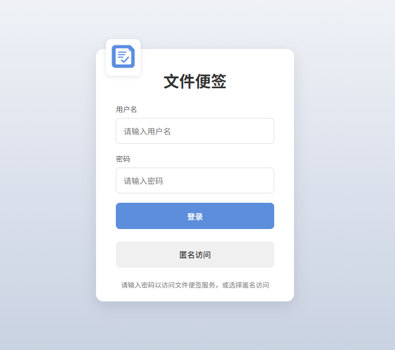
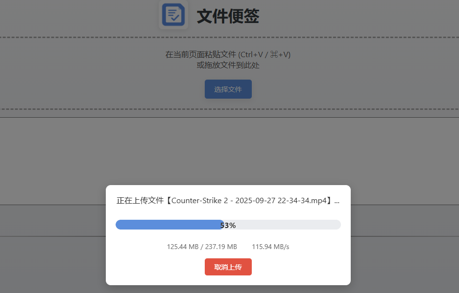

# 文件便签 (File Note)

> 参考 XD 的 **[pasteboard.py](references/pasteboard.py)** 实现的文件共享和管理工具，使用 Java 重写并增强功能

## 📋 项目简介

一个简洁易用的文件共享和管理工具，支持多种文件上传方式，提供用户权限管理和文件预览功能。

## ✨ 功能特性

- **多种上传方式**：支持复制粘贴、拖拽、选择文件等多种上传方式
- **上传进度显示**：实时显示上传进度，避免上传大文件时无反馈
- **文本上传**：支持直接粘贴文本内容并保存
- **用户权限管理**：
  - 支持用户分组配置
  - 管理员角色可删除当前组内文件
  - 普通用户只能上传和查看文件
- **匿名访问**：支持配置匿名用户访问与文件上传，独立于普通用户组
- **文件预览**：支持文本、图片、视频等格式的在线预览
- **移动端适配**：响应式设计，支持移动设备访问
- **文件管理**：按年份/月份筛选查看文件

## 🖼️ 界面展示

### 登录页面



> 匿名用户登录界面


### 主界面


### 大文件上传



### 移动端适配


## 🛠️ 技术栈

- **后端**：Java 8 + Spring Boot 2.3.12.RELEASE
- **前端**：HTML5 + CSS3 + JavaScript
- **存储**：本地文件系统

## 🚀 快速使用

### 前提条件

- Java 8 或更高版本

### 打包后目录结构

最终打包后的 tar 包解压后将包含以下文件和目录：

```
file-note/
├── file-note-0.1.jar    # 应用程序 JAR 文件
├── application.yml      # 配置文件
├── start.sh             # Linux/Mac 启动脚本
└── start.bat            # Windows 启动脚本
```

### 运行步骤

1. 下载并解压最新的 tar 包
2. 在解压后的目录中创建或修改 `application.yml` 配置文件
3. 运行应用：

   **使用启动脚本（推荐）：**
   
   - **Linux/Mac：**
     ```bash
     # 赋予脚本执行权限
     chmod +x start.sh
     
     # 运行脚本
     ./start.sh
     ```
     
   - **Windows：**
     ```bash
     # 直接双击运行或在命令行中执行
     start.bat
     ```
     
   **使用传统命令：**
   ```bash
   java -jar file-note.jar
   ```
   
   **在后台运行（Linux/Mac）：**
   ```bash
   nohup java -jar file-note.jar > out.log 2>&1 &
   ```

4. 访问应用：http://localhost:8080

## ⚙️ 配置说明

主要配置文件：`application.yml`

### 基础配置示例

```yaml
# 服务器配置
server:
  port: 8080
  servlet:
    session:
      timeout: 1h

# 文件上传配置
spring:
  servlet:
    multipart:
      max-file-size: 10GB
      max-request-size: 10GB

# 文件存储目录与用户配置
file-note:
  # 匿名访问配置
  anonymous:
    enabled: true
    name: 匿名用户组
    directory: /opt/file-note/anonymous
    role: user
  # 用户组配置
  groups:
    - name: 对外共享组
      directory: /opt/file-note/shared
      users:
        - username: user
          password: pass
          role: user
        - username: sadmin
          password: sadmin123
          role: admin
    - name: 内部用户组
      directory: /opt/file-note/data
      users:
        - username: admin
          password: admin123
          role: admin
```

### 配置说明

**服务器配置**：设置端口和会话超时时间
**文件上传配置**：设置文件大小限制

**匿名访问配置**：
  - `enabled`：是否启用匿名访问，true为启用，false为禁用
  - `name`：匿名用户组的显示名称，将在界面上展示
  - `directory`：匿名用户的文件存储目录，需确保系统有读写权限
  - `role`：匿名用户的角色（user 或 admin），admin角色可以删除当前组内文件，建议设置为user以保证安全性

**用户组配置**：
- `name`：用户组名称
- `directory`：文件存储目录，需确保系统有读写权限
- `users`：用户列表
  - `username`：用户名
  - `password`：密码
  - `role`：用户角色（user 或 admin），admin角色可以删除当前组内文件

