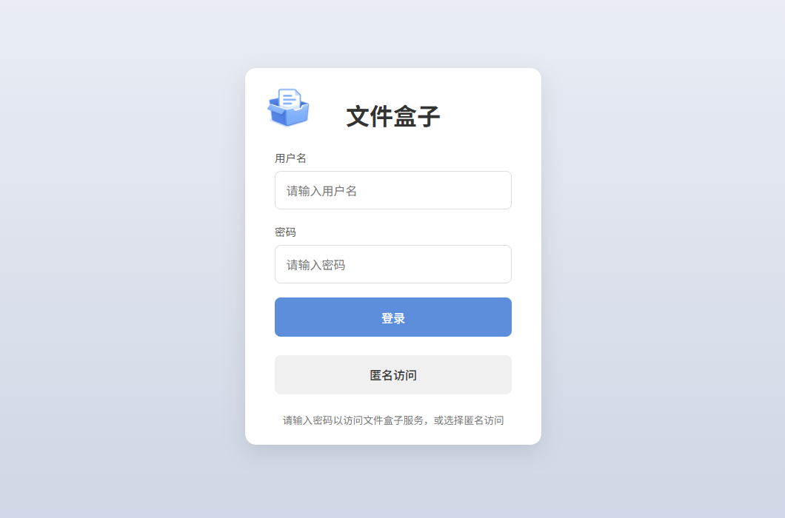
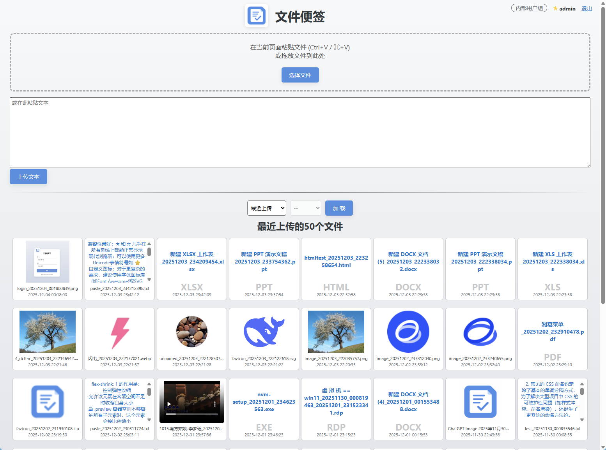
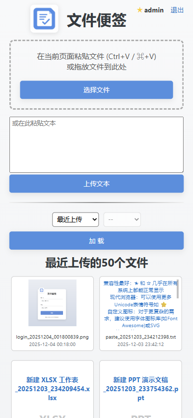

# 文件便签 (File Note)

> 参考 XD 的 pasteboard.py 实现的文件共享和管理工具，使用 Java 重写并增强功能

## 📋 项目简介

一个简洁易用的文件共享和管理工具，支持多种文件上传方式，提供用户权限管理和文件预览功能。

## ✨ 功能特性

- **多种上传方式**：支持复制粘贴、拖拽、选择文件等多种上传方式
- **文本上传**：支持直接粘贴文本内容并保存
- **用户权限管理**：
  - 支持用户分组配置
  - 管理员角色可删除当前组内文件
  - 普通用户只能上传和查看文件
- **文件预览**：支持文本、图片、视频等格式的在线预览
- **移动端适配**：响应式设计，支持移动设备访问
- **文件管理**：按年份/月份筛选查看文件

## 🖼️ 界面展示

### 登录页面



### 主界面



### 移动端适配



## 🛠️ 技术栈

- **后端**：Java 8 + Spring Boot 2.3.12.RELEASE
- **前端**：HTML5 + CSS3 + JavaScript
- **存储**：本地文件系统

## 🚀 快速使用

### 前提条件

- Java 8 或更高版本

### 运行步骤

1. 下载最新的 jar 包
2. 在 jar 包同级目录创建 `application.yml` 配置文件
3. 运行命令：

```bash
java -jar file-note.jar
```

4. 访问应用：http://localhost:8080

## ⚙️ 配置说明

主要配置文件：`application.yml`

### 基础配置示例

```yaml
# 服务器配置
server:
  port: 8080
  servlet:
    session:
      timeout: 1h

# 文件上传配置
spring:
  servlet:
    multipart:
      max-file-size: 10GB
      max-request-size: 10GB

# 文件存储目录与用户配置
file-note:
  groups:
    - name: 对外共享组
      directory: /opt/file-note/shared
      users:
        - username: user
          password: pass
          role: user
        - username: sadmin
          password: sadmin123
          role: admin
    - name: 内部用户组
      directory: /opt/file-note/data
      users:
        - username: admin
          password: admin123
          role: admin
```

### 配置说明

- **服务器配置**：设置端口和会话超时时间
- **文件上传配置**：设置文件大小限制
- **用户组配置**：
  - `name`：用户组名称
  - `directory`：文件存储目录
  - `users`：用户列表，包含用户名、密码和角色（user 或 admin）

